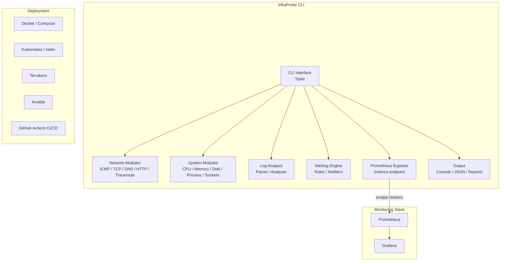
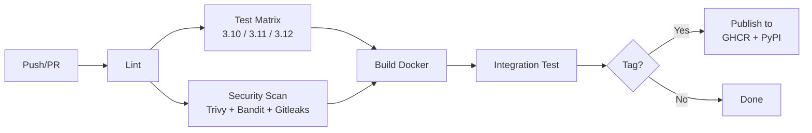

# InfraProbe

[](https://github.com/talatcanayhan/infraprobe/actions/workflows/ci.yml)
[](https://codecov.io/gh/talatcanayhan/infraprobe)
[](https://www.python.org/downloads/)
[](https://opensource.org/licenses/MIT)
[](https://github.com/psf/black)

**A Python-based infrastructure monitoring toolkit that probes your network, systems, and services — built with real DevOps practices from code to cloud.**

InfraProbe implements networking protocols from scratch using raw sockets and reads Linux system metrics directly from `/proc` — no wrapper libraries. It exposes Prometheus metrics and ships with a full DevOps stack: Docker, Kubernetes/Helm, Terraform, Ansible, and CI/CD pipelines.

## Architecture



## Features

### Network Probing
- **ICMP Ping** — Raw socket implementation with checksum calculation per RFC 1071
- **TCP Port Scanner** — Async concurrent scanning with service banner grabbing
- **DNS Resolver** — Raw DNS query packet construction per RFC 1035 over UDP
- **HTTP/HTTPS Checker** — Health checks with TLS certificate validation and expiry alerting
- **Traceroute** — TTL-based path discovery via ICMP Time Exceeded responses
- **Bandwidth Monitor** — Interface throughput measurement via `/proc/net/dev`

### System Monitoring
- **CPU** — Utilization breakdown (user/system/idle/iowait/steal) from `/proc/stat`
- **Memory** — Usage tracking with buffer/cache awareness from `/proc/meminfo`
- **Disk** — Space usage and I/O statistics from `/proc/diskstats`
- **Processes** — Resource consumption, state tracking, zombie detection via `/proc/[pid]`
- **Sockets** — TCP/UDP socket states and file descriptor monitoring from `/proc/net/tcp`

### Observability
- **Prometheus Metrics** — Native `/metrics` endpoint with Gauges, Counters, and Histograms
- **Grafana Dashboards** — Pre-built dashboards for overview, network, and system metrics
- **Alerting** — Threshold-based rules with webhook/email notifications
- **Structured Logging** — JSON log output for log aggregation pipelines

### DevOps
- **Docker** — Multi-stage build, non-root user, health checks
- **Docker Compose** — Full stack: InfraProbe + Prometheus + Grafana
- **GitHub Actions** — CI/CD with linting, testing, security scanning, Docker build
- **Kubernetes** — Manifests with NetworkPolicy, ServiceMonitor, resource limits
- **Helm Chart** — Parameterized deployment with HPA and production values
- **Terraform** — Modular infrastructure provisioning with environment separation
- **Ansible** — Role-based server configuration and automated deployment
- **systemd** — Service and timer units for bare-metal deployment

## Quick Start

### Docker Compose (recommended)

```bash
# Clone the repository
git clone https://github.com/talatcanayhan/infraprobe.git
cd infraprobe

# Start the full monitoring stack
make docker-up

# View dashboards
# Grafana:    http://localhost:3000 (admin/admin)
# Prometheus: http://localhost:9090
# Metrics:    http://localhost:9100/metrics
```

### Local Installation

```bash
# Install from source
pip install .

# Or install in development mode
make dev
```

## Usage

```bash
# Ping a target with raw ICMP
sudo infraprobe ping 8.8.8.8 --count 5

# Scan ports on a host
infraprobe scan 192.168.1.1 --ports 1-1024

# Resolve DNS records
infraprobe dns example.com --record-type A --nameserver 8.8.8.8

# Check HTTP endpoint + TLS certificate
infraprobe http https://example.com --check-tls

# Trace network path
sudo infraprobe traceroute 8.8.8.8 --max-hops 30

# Show system metrics
infraprobe system --cpu --memory --disk

# Parse and analyze logs
infraprobe logs /var/log/syslog --pattern "error|fail"

# Start continuous monitoring
infraprobe monitor config.yml

# Start Prometheus metrics server
infraprobe serve --port 9100

# Generate a report
infraprobe report config.yml --format html
```

All commands support `--output json` for machine-readable output and `--verbose`/`--quiet` for log level control.

## Configuration

Copy `config.example.yml` to `config.yml` and customize for your environment. See [docs/configuration.md](docs/configuration.md) for the full reference.

## Deployment

| Method | Guide |
|--------|-------|
| Docker Compose | `make docker-up` |
| Kubernetes/Helm | [docs/deployment.md](docs/deployment.md#kubernetes) |
| Terraform + Ansible | [docs/deployment.md](docs/deployment.md#terraform-ansible) |
| Bare metal (systemd) | [docs/deployment.md](docs/deployment.md#systemd) |

## Development

```bash
# Install dev dependencies
make dev

# Run tests
make test

# Run linters
make lint

# Auto-format code
make format

# Run security checks
make security

# Build Docker image
make docker-build
```

## Project Structure

```
infraprobe/
├── src/infraprobe/          # Application source code
│   ├── network/             # ICMP, TCP, DNS, HTTP, traceroute, bandwidth
│   ├── system/              # CPU, memory, disk, process, socket monitors
│   ├── logging_analysis/    # Log parsing and anomaly detection
│   ├── metrics/             # Prometheus exporter and collector
│   ├── alerting/            # Alert rules engine and notifiers
│   └── output/              # Console (Rich), JSON, and report formatters
├── tests/                   # Unit and integration tests
├── docker/                  # Dockerfiles (production + dev)
├── deploy/
│   ├── kubernetes/          # Raw K8s manifests
│   ├── helm/                # Helm chart
│   ├── terraform/           # Infrastructure provisioning
│   └── ansible/             # Configuration management
├── monitoring/              # Prometheus + Grafana configs and dashboards
├── loadtest/                # Locust load testing
├── systemd/                 # systemd service and timer units
└── docs/                    # Architecture, configuration, deployment guides
```

## CI/CD Pipeline



## License

MIT License. See [LICENSE](LICENSE) for details.
