# Architecture

## Overview

InfraProbe is a modular Python CLI tool that monitors network targets and system resources, exposes Prometheus metrics, and supports alerting.

```mermaid
graph TB
    subgraph "CLI Layer"
        CLI[cli.py<br/>Typer Commands]
        CONFIG[config.py<br/>Pydantic Models]
    end

    subgraph "Network Probes"
        ICMP[icmp.py<br/>Raw Socket Ping]
        TCP[tcp.py<br/>Async Port Scanner]
        DNS[dns_resolver.py<br/>Raw DNS Queries]
        HTTP[http_checker.py<br/>HTTP + TLS Check]
        TRACE[traceroute.py<br/>TTL-based Trace]
        BW[bandwidth.py<br/>/proc/net/dev]
    end

    subgraph "System Monitors"
        CPU[cpu.py<br/>/proc/stat]
        MEM[memory.py<br/>/proc/meminfo]
        DISK[disk.py<br/>statvfs + diskstats]
        PROC[process.py<br/>/proc/pid/]
        SOCK[sockets.py<br/>/proc/net/tcp]
    end

    subgraph "Processing"
        LOGS[Log Analysis<br/>Parser + Analyzer]
        ALERT[Alerting Engine<br/>Rules + Notifiers]
    end

    subgraph "Output"
        CONSOLE[Console<br/>Rich Tables]
        JSON[JSON Output]
        REPORT[Reports<br/>HTML/Markdown]
        PROM[Prometheus<br/>/metrics endpoint]
    end

    CLI --> CONFIG
    CLI --> ICMP & TCP & DNS & HTTP & TRACE
    CLI --> CPU & MEM & DISK & PROC & SOCK
    CLI --> LOGS & ALERT
    CLI --> CONSOLE & JSON & REPORT & PROM
```



## Key Design Principles

1. **Stdlib networking** — All network modules use raw Python sockets, `struct`, and `ssl`. No wrapper libraries (scapy, icmplib). This proves protocol-level understanding.

2. **Direct /proc reads** — All system modules read `/proc` directly. No psutil. This proves Linux kernel internals knowledge.

3. **Minimal dependencies** — Only 7 runtime dependencies: typer, rich, pyyaml, pydantic, prometheus-client, requests, jinja2.

4. **Async I/O** — The port scanner uses `asyncio` for concurrent scanning without threads.

5. **Prometheus-native** — Metrics follow Prometheus naming conventions and use proper metric types (Gauge, Counter, Histogram).

## Data Flow

```
Config (YAML) → CLI Parser → Check Scheduler → Network/System Probes
                                    ↓
                            Prometheus Metrics ← Prometheus Scrape
                                    ↓
                            Alert Engine → Webhook/Email/Log
                                    ↓
                            Grafana Dashboards
```
